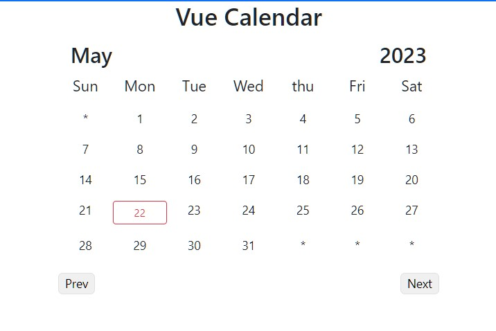

# vue3

## Project setup
```
npm install
```

### Compiles and hot-reloads for development
```
npm run serve
```

### Compiles and minifies for production
```
npm run build
```

### Lints and fixes files
```
npm run lint
```

### Customize configuration
See [Configuration Reference](https://cli.vuejs.org/config/).

### App Header


### App DC Heroes


### App calendar


### App Clock


### App CURD Operation (connectivity API/BackEnd) 


### App MarkDown (The use of mixins and data properties helps in maintaining code reusability and separation of concerns)


### Chat App


use follow backend for chat App
```bash
   git clone https://github.com/PushpaKumara89/chat-app-backend.git
